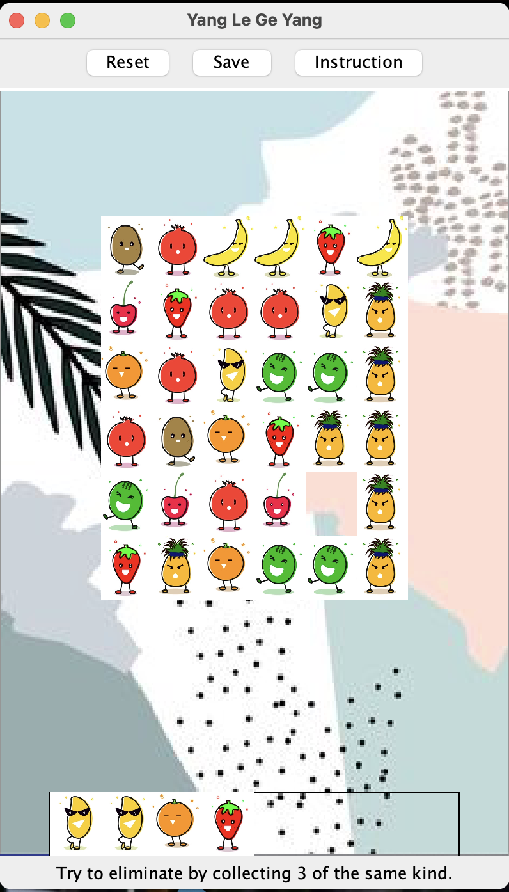

# YLGYtileElimination
This is a tile elimination game, inspired by a once super popular Chinese video game that I've spent way too many hours playing.

### An overview of each of the classes, and what their function is in the overall game.

  **CardSlot**  
    Visually, the CardSlot class appears at the bottom of the screen. Once a tile
    is clicked, it will move to the CardSlot. The CardSlot class consists of an
    ArrayList of tiles. It will always put tiles with the same pattern next to each
    other. This class keeps track of the state of the game, as the player loses
    once there are 8 tiles collected. The class contains functions including add,
    eliminate, checkLose, draw numSlotsFilled, getSlots.   
  **GameLayout**  
    The GameLayout class holds all the content of the game and interacts with the
    user's actions (such as mouseclicks). It keeps track of the status of the game,
    which is updated whenever an action is performed by the user. It works closely
    with the RunYLGY class. The functions in this class include updateStatus, reset,
    saveProgress, paintComponent, drawBackground, getYlgy, and getPreferredSize.   
  **Layer**  
    A Layer consists of a 2D-array of tiles. Its constructor takes in parameters
    width, height, and if the layer is empty. The Layer class contains functions
    like addTile, draw, getTileLayer, and isEmpty.   
  **RunYLGY**  
    This class is the runnable and graphic part of the game. It pulls together all
    the JPanels, JButtons, and the frame.   
  **Tile**  
    There are 6 types of tiles, each represented by an int from 0 to 8. The
    visual of each instance of tile is represented by imported image. The
    Tile class has functions including getPattern and draw.   
  **YangLeGeYang**  
    This is the class that brings together Layer and CardSlot. Multiple layers will
    be on top of each other, so an array is used for layers. This class is also
    in charge of file I/O, as it can save data from the piles and the card slots as
    well as read from the files with the data. This class records the status of the
    game (meaning if the player has won or lose). The YangLeGeYang class contains
    functions including reset, savePiles, saveCardSlots, buildFromSaved, moveTiles,
    getTilePile, getCardSlot, isGameOver, and hasWon.   
